# Architecture Documentation - MoneyPrinterV2

**Version:** 1.0
**Last Updated:** 2025-11-07
**Status:** Production Architecture

---

## Table of Contents

1. [System Overview](#system-overview)
2. [Architecture Layers](#architecture-layers)
3. [Component Diagrams](#component-diagrams)
4. [Data Flow](#data-flow)
5. [Dependency Injection](#dependency-injection)
6. [Design Patterns](#design-patterns)
7. [Technology Stack](#technology-stack)

---

## System Overview

MoneyPrinterV2 is an enterprise-grade automation framework built with Python that provides comprehensive content creation and social media management capabilities.

### High-Level Architecture

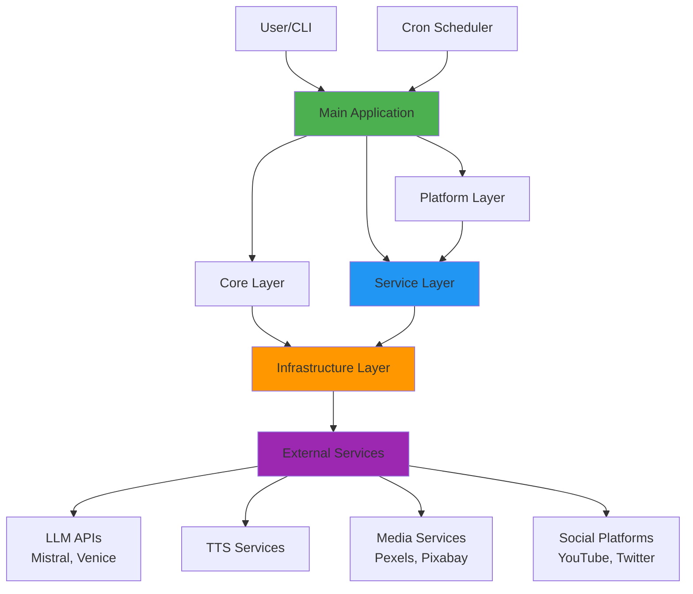

### Key Characteristics

- **Layered Architecture**: Clear separation of concerns
- **Dependency Injection**: Protocol-based loose coupling
- **Enterprise Patterns**: Singleton, Factory, Service Layer
- **Type Safety**: ~95% type hint coverage
- **Test Coverage**: ~60% with 495+ tests
- **Performance**: Connection pooling, caching, parallel processing
- **Security**: Environment-based secrets, input validation

---

## Architecture Layers

### 1. Core Layer

**Purpose**: Fundamental application functionality

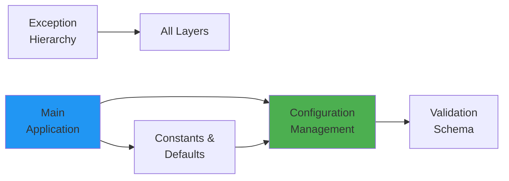

**Components**:
- `config.py`: ConfigManager singleton (18x faster than file reads)
- `config_schema.py`: Pydantic validation models
- `constants.py`: Centralized default values
- `exceptions.py`: 26 custom exceptions
- `main.py`: Interactive CLI application
- `cron.py`: Scheduled automation

### 2. Service Layer

**Purpose**: High-level business logic and external integrations

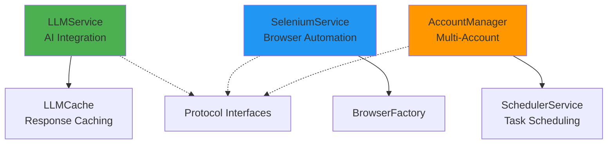

**Components**:
- `llm_service.py`: LLM interaction wrapper with caching
- `llm_cache.py`: Response caching (30-70% cost savings)
- `selenium_service.py`: 20+ browser automation methods
- `browser_factory.py`: Browser instance creation
- `account_manager.py`: Account rotation and management
- `scheduler_service.py`: CRON-like task scheduling
- `protocols.py`: 7 protocol interfaces for DI

### 3. Infrastructure Layer

**Purpose**: Low-level utilities and cross-cutting concerns

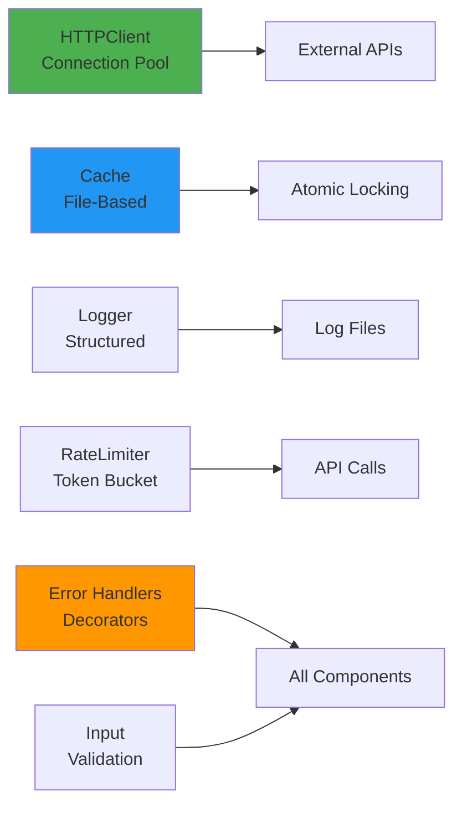

**Components**:
- `http_client.py`: Connection pooling (~40% faster)
- `cache.py`: Atomic file caching
- `logger.py`: Logging configuration
- `rate_limiter.py`: API rate limiting
- `error_handlers.py`: 6 reusable decorators
- `validation.py`: Input sanitization
- `health_checks.py`: API validation

### 4. Platform Layer

**Purpose**: Platform-specific automation implementations

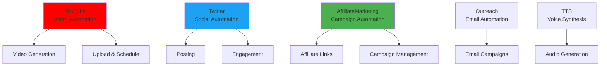

**Components**:
- `classes/YouTube.py`: YouTube automation (1000+ lines)
- `classes/Twitter.py`: Twitter automation
- `classes/AFM.py`: Affiliate marketing
- `classes/Outreach.py`: Outreach campaigns
- `classes/Tts.py`: Text-to-speech

---

## Component Diagrams

### Video Generation Flow

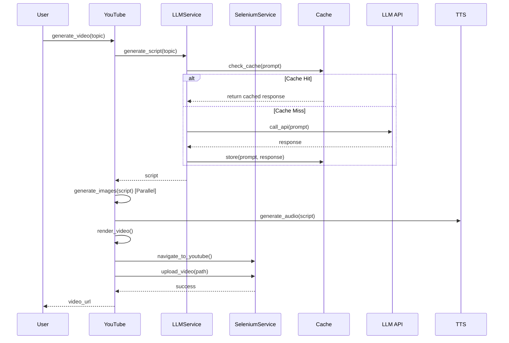

### Configuration Management

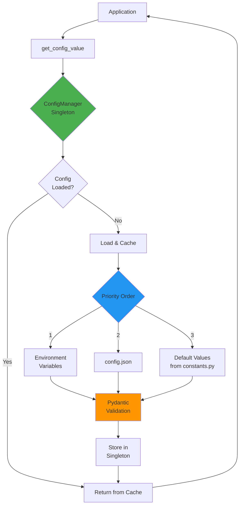

### Dependency Injection Pattern

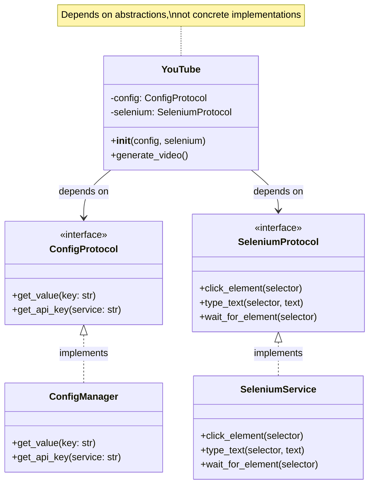

---

## Data Flow

### Request Flow (YouTube Video Generation)

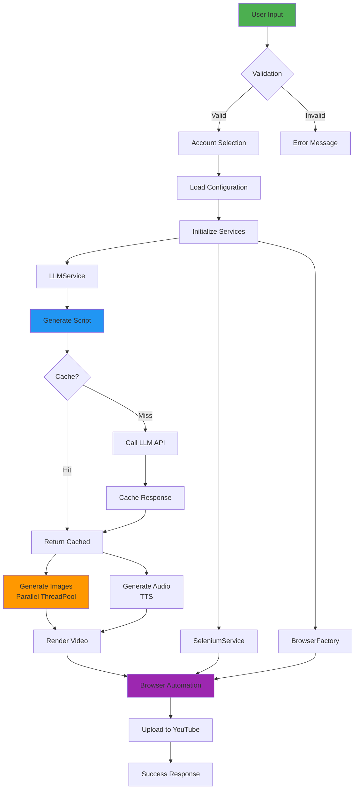

### Cache Architecture

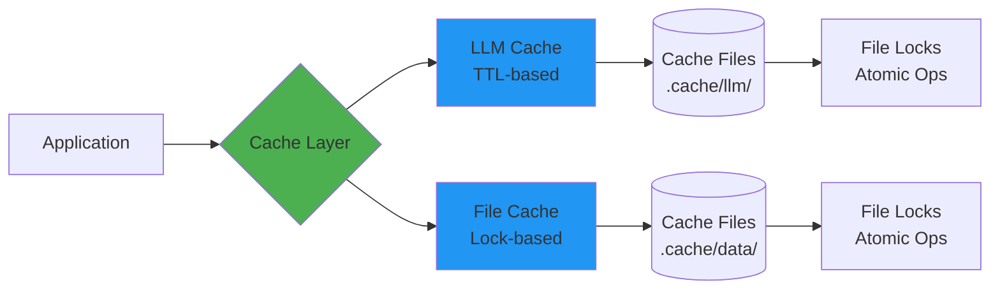

---

## Dependency Injection

### Protocol-Based DI (Phase 8 Implementation)

MoneyPrinterV2 uses Protocol interfaces for dependency injection, enabling:
- **Loose coupling**: Components depend on abstractions
- **Testability**: Easy mocking with protocol implementations
- **Flexibility**: Swap implementations without changing code

### Available Protocols

1. **ConfigProtocol**: Configuration access
2. **CacheProtocol**: Caching operations
3. **SeleniumProtocol**: Browser automation
4. **LLMProtocol**: LLM interactions
5. **HTTPProtocol**: HTTP client
6. **LoggerProtocol**: Logging
7. **ValidationProtocol**: Input validation

### DI Usage Example

```python
from protocols import SeleniumProtocol, ConfigProtocol
from selenium_service import SeleniumService
from config import ConfigManager

class MyAutomation:
    def __init__(
        self,
        config: ConfigProtocol,
        selenium: SeleniumProtocol
    ):
        self.config = config
        self.selenium = selenium

    def run(self):
        api_key = self.config.get_api_key("mistral")
        self.selenium.navigate_to("https://example.com")

# Constructor injection
config = ConfigManager.get_instance()
selenium = SeleniumService(browser)
automation = MyAutomation(config=config, selenium=selenium)
```

### Testability

```python
from unittest.mock import Mock

def test_automation():
    # Mock protocols for testing
    mock_config = Mock(spec=ConfigProtocol)
    mock_selenium = Mock(spec=SeleniumProtocol)

    mock_config.get_api_key.return_value = "test-key"

    # Test with mocks
    automation = MyAutomation(
        config=mock_config,
        selenium=mock_selenium
    )
    automation.run()

    # Verify interactions
    mock_config.get_api_key.assert_called_with("mistral")
    mock_selenium.navigate_to.assert_called_once()
```

---

## Design Patterns

### Implemented Patterns

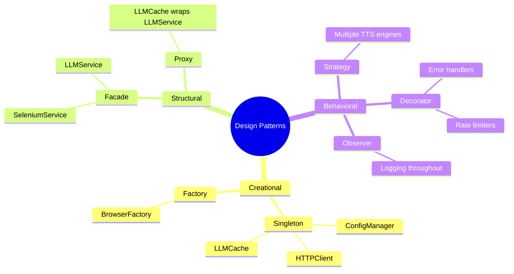

### Pattern Details

#### 1. Singleton Pattern
**Used for**: ConfigManager, HTTPClient, LLMCache

```python
class ConfigManager:
    _instance = None

    @classmethod
    def get_instance(cls):
        if cls._instance is None:
            cls._instance = cls()
        return cls._instance
```

**Benefits**:
- Single configuration source
- Connection pool reuse
- Cache consistency

#### 2. Factory Pattern
**Used for**: BrowserFactory

```python
class BrowserFactory:
    @staticmethod
    def create_browser(profile_path: str) -> webdriver.Firefox:
        # Complex browser setup logic
        return configured_browser
```

**Benefits**:
- Centralized browser configuration
- Consistent browser instances
- Easy to modify browser settings

#### 3. Facade Pattern
**Used for**: SeleniumService, LLMService

```python
class SeleniumService:
    def click_element(self, selector: str):
        # Wraps complex Selenium operations
        element = self.wait_for_element(selector)
        element.click()
```

**Benefits**:
- Simplified interface
- Reduced coupling
- Easier testing

#### 4. Decorator Pattern
**Used for**: Error handlers, rate limiters

```python
@retry_on_failure(max_attempts=3)
@rate_limit(max_calls=10, period=60)
def api_call():
    return make_request()
```

**Benefits**:
- Cross-cutting concerns
- Reusable functionality
- Clean separation

---

## Technology Stack

### Core Technologies

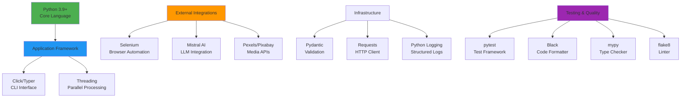

### Dependencies

| Category | Technology | Purpose |
|----------|-----------|---------|
| **Core** | Python 3.9+ | Programming language |
| **Browser** | Selenium | Web automation |
| **AI** | Mistral AI | LLM integration |
| **Validation** | Pydantic | Data validation |
| **HTTP** | Requests | HTTP client |
| **Testing** | pytest | Test framework |
| **Formatting** | Black, isort | Code formatting |
| **Linting** | flake8 | Code quality |
| **Type Checking** | mypy | Static type checking |
| **Media** | Pillow | Image processing |
| **Video** | MoviePy | Video editing |
| **Audio** | Various TTS | Text-to-speech |

### Development Tools

- **Version Control**: Git
- **CI/CD**: GitHub Actions
- **Documentation**: Sphinx, Mermaid
- **Dependency Management**: pip-tools
- **Pre-commit Hooks**: Black, flake8, mypy, isort

---

## Performance Optimizations

### Implemented Optimizations

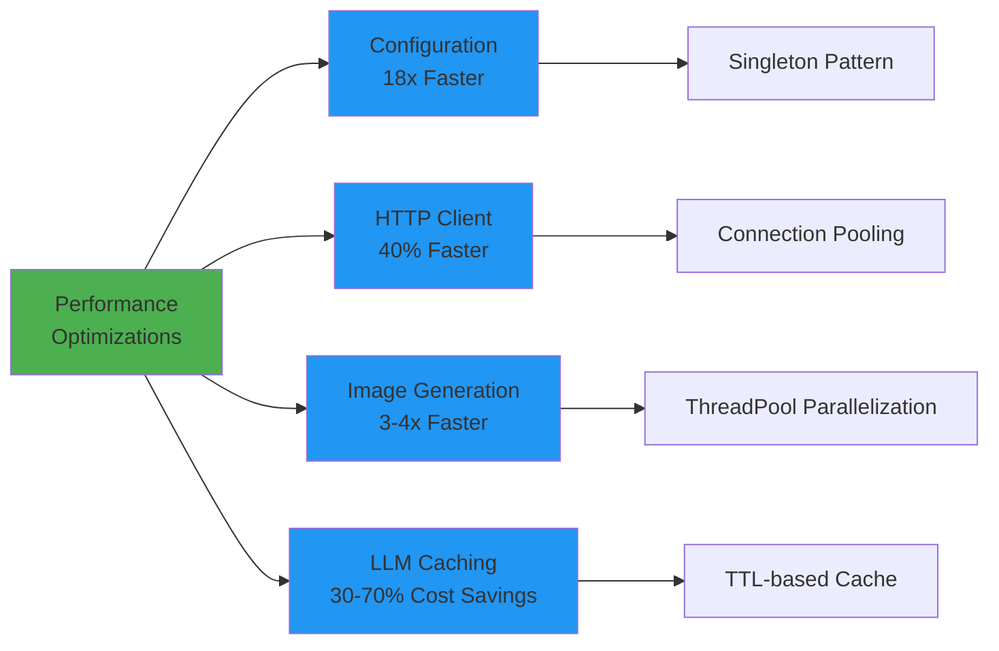

### Benchmark Results

| Operation | Before | After | Improvement |
|-----------|--------|-------|-------------|
| Config Access | 18 file reads/video | 1 read + cache | **18x faster** |
| HTTP Requests | New connection each | Connection pool | **40% faster** |
| Image Generation | Sequential | Parallel (4 threads) | **3-4x faster** |
| LLM API Costs | No caching | TTL cache | **30-70% savings** |

---

## Security Architecture

### Security Layers

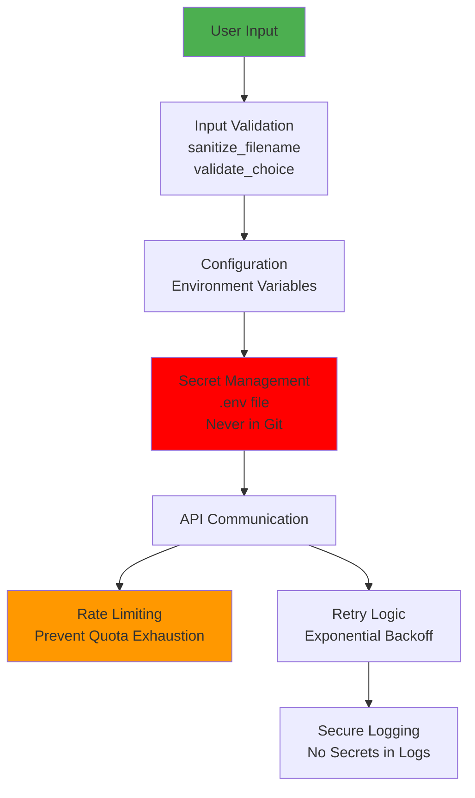

### Security Features

1. **Secrets Management**
   - Environment variables via `.env`
   - Never committed to version control
   - Priority: ENV → config.json → defaults

2. **Input Validation**
   - Path traversal prevention
   - Command injection prevention
   - Type validation with Pydantic

3. **API Security**
   - Rate limiting
   - Connection pooling with timeouts
   - Retry with exponential backoff

4. **Logging**
   - Secrets redacted from logs
   - Structured logging format
   - File rotation

---

## Future Architecture Considerations

### Potential Enhancements

1. **Async I/O**
   - Convert to `asyncio` for better I/O performance
   - Non-blocking API calls
   - Impact: Requires significant refactoring

2. **Microservices**
   - Split into separate services
   - Better scalability
   - Independent deployment

3. **Message Queue**
   - Add Redis/RabbitMQ for job queuing
   - Distributed task processing
   - Better reliability

4. **Container Orchestration**
   - Docker containerization
   - Kubernetes for scaling
   - Cloud deployment ready

---

## Diagram Legend

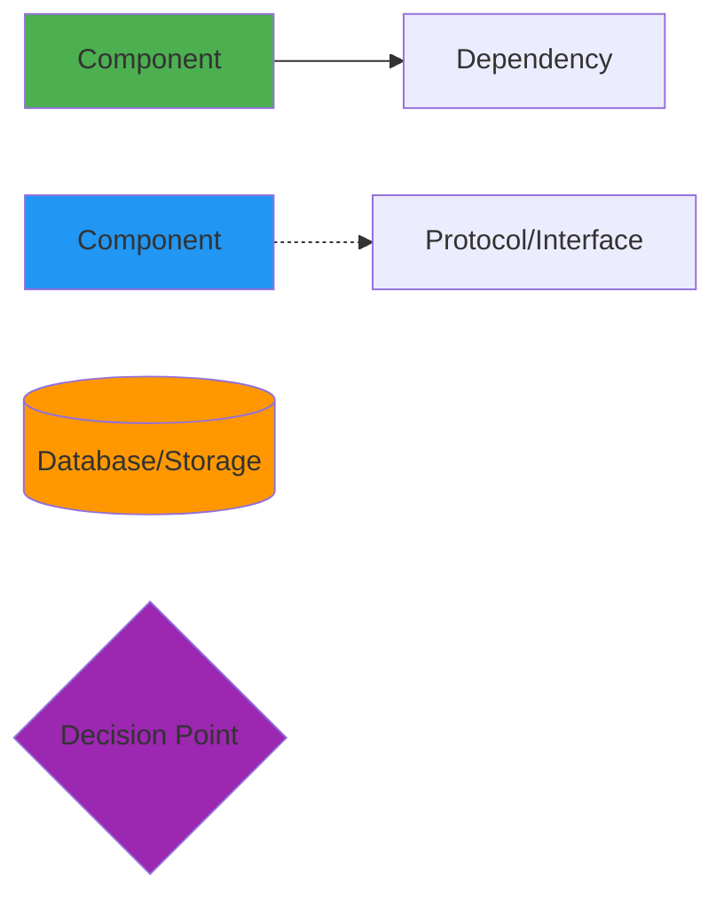

- **Green**: Primary components
- **Blue**: Services/implementations
- **Orange**: Storage/external
- **Purple**: Control flow/decisions
- **Solid arrows**: Direct dependencies
- **Dashed arrows**: Protocol/interface relationships

---

## Additional Resources

- **TECHNICAL_DEBT.md**: Complete cleanup history
- **NAMING_CONVENTIONS.md**: Code naming standards
- **CONFIGURATION.md**: Configuration reference
- **DOCSTRING_STYLE_GUIDE.md**: Documentation standards
- **API Documentation**: See `docs/api/`

---

**Version History**

| Date | Version | Changes |
|------|---------|---------|
| 2025-11-07 | 1.0 | Initial architecture documentation with Mermaid diagrams |

---

**End of Architecture Documentation**
